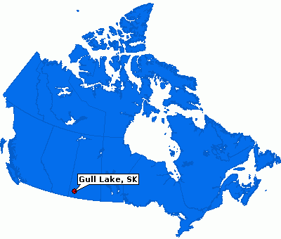

# slides
 
!SLIDE

# clojure is my favourite ruby

## steven@c42.in

!SLIDE

# who am I?

!NOTES

here are some notes

!SLIDE

!SLIDE

!SLIDE

!SLIDE

!SLIDE

!SLIDE

1. t-logger (12 lines of clojure)
2. market data republisher (300 lines of clojure)
3. web app + service (2000 lines of clojure)
4. _trade capture and positions management_ (5000 lines of ruby)

!SLIDE

!SLIDE

!SLIDE

# (clojuremonk.com is coming)

!SLIDE

# TODO: revisit

1. baseline
2. history
3. optional intro
4. curiosity
5. good feelings
6. homoiconicity
7. state of the world

!SLIDE

# BASELINE

!SLIDE

# have you read about clojure?

!SLIDE

# have you tried clojure?

!SLIDE

# have you read some lisp literature?

### (sicp, little schemer, land of lisp, etc.)

!SLIDE

# do you believe this?

@@@ clojure
(= closure object)
@@@

!SLIDE

# (we'll come back to this)

!SLIDE

# INTRO

!SLIDE

@@@ clojure
(stretch image 128)
@@@

!SLIDE

@@@ clojure
(stretch image 128)
@@@

# function call

!SLIDE

@@@ clojure
(when-not (stretched? image)
  (stretch image 128))
@@@

!SLIDE

@@@ clojure
(when-not (stretched? image)
  (stretch image 128))
@@@

# macro call

!SLIDE

# (that's nice, isn't it?)

!SLIDE

@@@ clojure
(defmacro when-not
  "Evaluates test. If logical false, evaluates body in an implicit do."
  {:added "1.0"}
  [test & body]
    (list 'if test nil (cons 'do body)))
@@@

!SLIDE

# "if you want a different for-loop, just write one. you shouldn't have to wait for someone else to do it."

!SLIDE

@@@ clojure
[one two three four]
@@@

!SLIDE

@@@ clojure
[one two three four]
[one, two, three, four]
@@@

# vector

!SLIDE

@@@ clojure
{ :name  "Steven Deobald"
  :has   "Wood"
  :needs "Gold" }
@@@

!SLIDE

@@@ clojure
{ :name  "Steven Deobald"
  :has   "Wood"
  :needs "Gold" }
@@@

# map

!SLIDE

@@@ clojure
(map inc [3 7 14 15 22 41])
@@@

!SLIDE

@@@ clojure
'(one two three four seven)
@@@

!SLIDE

@@@ clojure
'(one two three four seven)
@@@

# seq (list)

!SLIDE

@@@ clojure
['one' 'two' 'three' 'four' 'seven']
@@@

!SLIDE

@@@ clojure
['one' 'two' 'three' 'four' 'seven']
@@@

# garbage!

!SLIDE

    => [one' two' three' four' seven']

!SLIDE

@@@ clojure
["one" "two" "three" "four" "seven"]
@@@

# strings are always double-quotes

!SLIDE

# HISTORY

!SLIDE

# 1958

!SLIDE

!SLIDE

!SLIDE

!SLIDE

# AI

### code written in its own data structures

!SLIDE

# 1966 - 1990

### "AI winter"

!SLIDE

# 1970

!SLIDE

# yay, memory management!

!SLIDE

!SLIDE

# 30 years go by.

!SLIDE

* Stanford LISP
* MACLISP
* InterLisp
* Franz Lisp
* XLISP
* Standard Lisp
* ZetaLisp
* Le Lisp
* Spice Lisp
* NIL
* S-1 Lisp
* Dylan
* EuLisp
* ISLISP
* Scheme
* Common Lisp
* ACL2

!SLIDE

# why another lisp? why now?

!SLIDE

# literature

### sicp, reasoned schemer, lisp in small pieces

!SLIDE

# <3 homoiconicity

### a language written in its own data structures may not have beaten the touring test, but it's still a good idea.

!SLIDE

# why clojure, specifically?

!SLIDE

# "concurrency is the new memory management"

!SLIDE

# do you have multiple cores in the laptop in front of you?

!SLIDE

# time matters

!SLIDE

!SLIDE

# rake db:migrate

!SLIDE

!SLIDE

# clojure reference types!

!SLIDE

# atom

@@@ clojure
(def person (atom {:name "Steven"}))

(defn become-ralph [p]
  (assoc p :name "Ralph"))

(swap! person become-ralph)
@@@

!SLIDE

# ref

@@@ clojure
(def person (ref {:name "Steven"}))

(defn become-ralph [p]
  (assoc p :name "Ralph"))

(dosync ; start a transaction
  (alter person become-ralph))
@@@

!SLIDE

# agent

@@@ clojure
(def person (agent {:name "Steven"}))

(defn become-ralph [p]
  (assoc p :name "Ralph"))

(send person become-ralph)
@@@

!SLIDE

# java.util.concurrent

@@@ clojure
(defn pipe []
  (let [q (java.util.concurrent.LinkedBlockingQueue.)
        EOQ (Object.)
        NIL (Object.)
        s (fn s [] (lazy-seq (let [x (.take q)]
                               (when-not (= EOQ x)
                                 (cons (when-not (= NIL x) x) (s))))))]
    [(s) (fn ([] (.put q EOQ)) ([x] (.put q (or x NIL))))]))
@@@

!SLIDE

# also, immutability is good for teeth.

!SLIDE

# CURIOSITY IS FUN

!SLIDE

# did `irb` change the way you program? (hands)

!SLIDE

# how about `rails console`?

!SLIDE

# leiningen

@@@
mkdir ~/bin
cd ~/bin
wget http://is.gd/leiningen
mv leiningen lein
chmod +x lein
...
lein new playproject
lein repl
@@@

!SLIDE

# FUNCTIONAL PROGRAMMING

!SLIDE

@@@ ruby
["beer", "doughnuts", "coffee", "hockey"].map(&upcase)
@@@

