# slides
 
!SLIDE

# clojure is my favourite ruby

## steven@c42.in

!SLIDE

# who am I?

!NOTES

here are some notes

!SLIDE

# Steven Deobald

# .
# .
# .

# steven@deobald.ca

!SLIDE

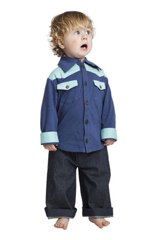

!SLIDE

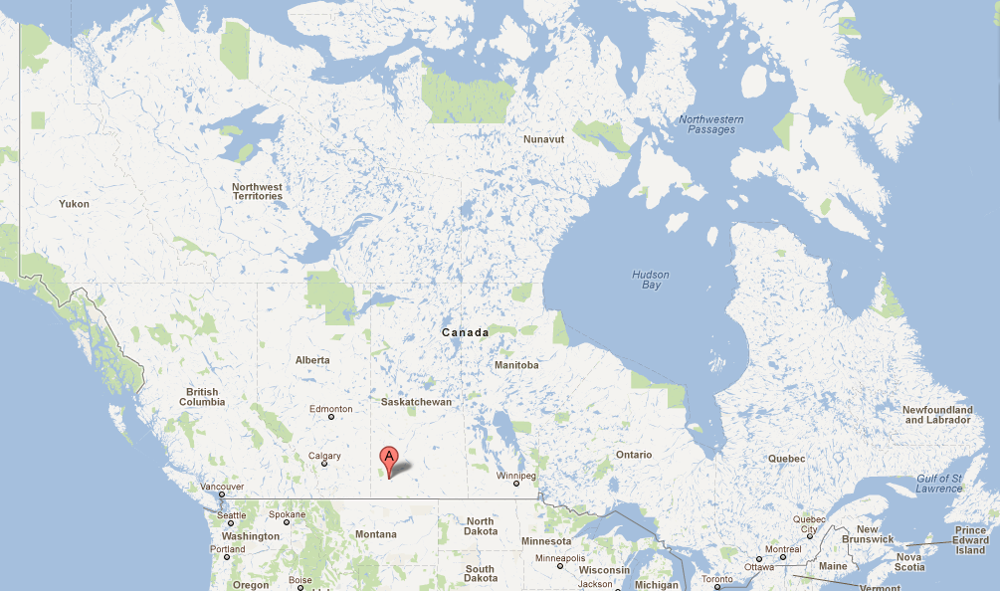

!SLIDE

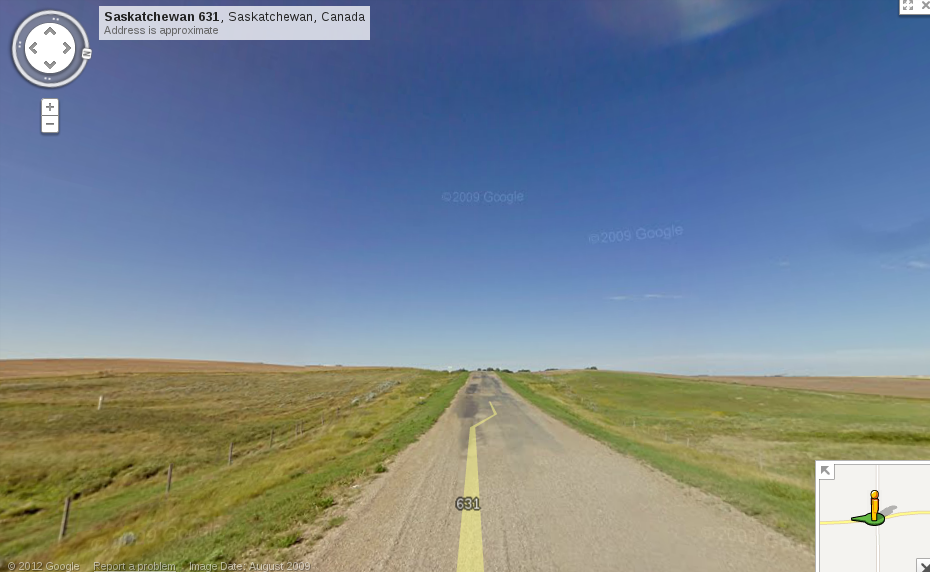

!SLIDE

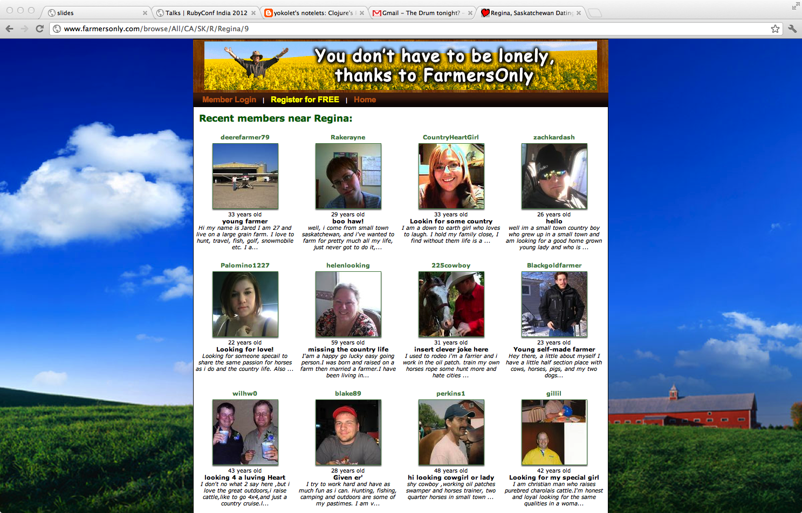

!SLIDE

!SLIDE

### http://c2.com/cgi/wiki?SmugLispWeenie

!SLIDE

!SLIDE

!SLIDE

1. t-logger (12 lines of clojure)
2. market data republisher (300 lines of clojure)
3. web app + service (2000 lines of clojure)
4. _trade capture and positions management_ (5000 lines of ruby)

!SLIDE

!SLIDE

!SLIDE

# (clojuremonk.com is coming)

!SLIDE

1. baseline
2. intro
3. history
4. curiosity is joy
6. functional programming
7. feeling good
8. metaprogramming
9. messaging concurrency

!SLIDE

# BASELINE

!SLIDE

# have you read about clojure?

!SLIDE

# have you tried clojure?

!SLIDE

# have you read some lisp literature?

### (sicp, little schemer, land of lisp, etc.)

!SLIDE

# do you believe this?

### .

@@@ clojure
(= closure object)
@@@

!SLIDE

# INTRO

!SLIDE

@@@ clojure
(stretch image 128)
@@@

!SLIDE

@@@ clojure
(stretch image 128)
@@@

# function call

!SLIDE

@@@ clojure
(when-not (stretched? image)
  (stretch image 128))
@@@

!SLIDE

@@@ clojure
(when-not (stretched? image)
  (stretch image 128))
@@@

# macro call

!SLIDE

# (that's nice, isn't it?)

!SLIDE

@@@ clojure
(defmacro when-not [test & body]
  (list 'if test nil (cons 'do body)))
@@@

!SLIDE

# "if you want a different for-loop, just write one. you shouldn't have to wait for someone else to do it."

!SLIDE

@@@ clojure
"hi, I'm a string."
@@@

!SLIDE

@@@ clojure
"hi, I'm a string."
@@@

# string

!SLIDE

@@@ clojure
:first-name
@@@

!SLIDE

@@@ clojure
:first-name
@@@

# keyword

!SLIDE

@@@ clojure
keyword
@@@

!SLIDE

@@@ clojure
keyword
@@@

# symbol

!SLIDE

@@@ clojure
[one two three four]
@@@

!SLIDE

@@@ clojure
[one two three four]
[one, two, three, four]
@@@

# vector

!SLIDE

@@@ clojure
{ :name  "Steven Deobald"
  :has   "Wood"
  :needs "Gold" }
@@@

!SLIDE

@@@ clojure
{ :name  "Steven Deobald"
  :has   "Wood"
  :needs "Gold" }
@@@

# map

!SLIDE

@@@ clojure
(map inc [3 7 14 15 22 41])
@@@

!SLIDE

@@@ clojure
'(one two three four seven)
@@@

!SLIDE

@@@ clojure
'(one two three four seven)
@@@

# seq (list)

!SLIDE

@@@ clojure
['one' 'two' 'three' 'four' 'seven']
@@@

!SLIDE

@@@ clojure
['one' 'two' 'three' 'four' 'seven']
@@@

# garbage!

!SLIDE

    => [one' two' three' four' seven']

!SLIDE

@@@ clojure
["one" "two" "three" "four" "seven"]
@@@

# strings are always double-quotes

!SLIDE

# HISTORY

!SLIDE

# 1958

!SLIDE

!SLIDE

!SLIDE

!SLIDE

# AI

### code written in its own data structures

!SLIDE

# 1966 - 1990

### "AI winter"

!SLIDE

# 1970

!SLIDE

# yay, memory management!

!SLIDE

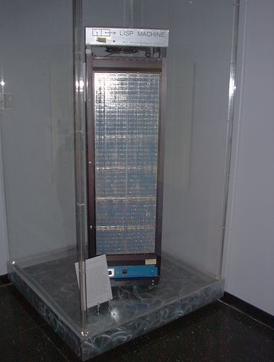

!SLIDE

# 40 years go by.

!SLIDE

* Stanford LISP
* MACLISP
* InterLisp
* Franz Lisp
* XLISP
* Standard Lisp
* ZetaLisp
* Le Lisp
* Spice Lisp
* NIL
* S-1 Lisp
* Dylan
* EuLisp
* ISLISP
* Scheme
* Common Lisp
* ACL2
* Arc

!SLIDE

# why another lisp? why now?

!SLIDE

# literature

### sicp, reasoned schemer, lisp in small pieces

!SLIDE

# <3 homoiconicity

### a language written in its own data structures may not have beaten the touring test, but it's still a good idea.

!SLIDE

# why clojure, specifically?

!SLIDE

# "concurrency is the new memory management"

!SLIDE

# do you have multiple cores in the laptop in front of you?

!SLIDE

# time matters

!SLIDE

# ( time.avi )

!SLIDE

!SLIDE

# rake db:migrate

!SLIDE

!SLIDE

# clojure reference types!

!SLIDE

# atom

@@@ clojure
(def me (atom {:name "Steven" :age 30}))

(defn celebrate-birthday [person]
  (assoc person :age (inc (:age person))))

(swap! me celebrate-birthday)
@@@

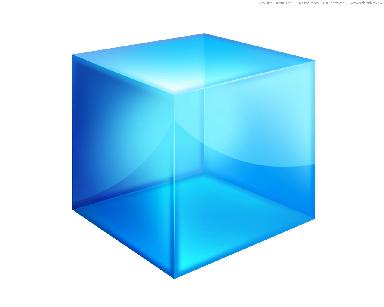

!SLIDE

# ref

@@@ clojure
(def me (atom {:name "Steven" :age 30}))

(defn celebrate-birthday [person]
  (assoc person :age (inc (:age person))))

(dosync ; start a transaction
  (alter me celebrate-birthday))
@@@

!SLIDE

# agent

@@@ clojure
(def me (atom {:name "Steven" :age 30}))

(defn celebrate-birthday [person]
  (assoc person :age (inc (:age person))))

(send me celebrate-birthday)
@@@

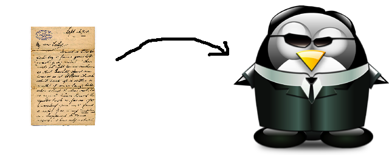

!SLIDE

# java.util.concurrent

@@@ clojure
(defn pipe []
  (let [q (java.util.concurrent.LinkedBlockingQueue.)
        EOQ (Object.)
        NIL (Object.)
        s (fn s [] (lazy-seq (let [x (.take q)]
                               (when-not (= EOQ x)
                                 (cons (when-not (= NIL x) x) (s))))))]
    [(s) (fn ([] (.put q EOQ)) ([x] (.put q (or x NIL))))]))
@@@

!SLIDE

# if nothing else, immutability promotes healthy teeth.

!SLIDE

# CURIOSITY IS JOY

!SLIDE

# did `irb` change the way you program?

!SLIDE

# how about `rails console`?

!SLIDE

# leiningen

### if curiosity is joy, a repl is joy. let's get one.

@@@
mkdir ~/bin
cd ~/bin
wget http://is.gd/leiningen
mv leiningen lein
chmod +x lein
...
lein new playproject
lein repl
@@@

!SLIDE

# ( demo/core.clj )

!SLIDE

@@@
ORA11 =
 (DESCRIPTION = 
   (ADDRESS_LIST =
     (ADDRESS = (PROTOCOL = TCP)(HOST = 127.0.0.1)(PORT = 1521))
   )
 (CONNECT_DATA =
   (SERVICE_NAME = ORA11)
 )
)
@@@

!SLIDE

# FUNCTIONAL PROGRAMMING

!SLIDE

# higher-order functions

!SLIDE

@@@ ruby
["beer", "doughnuts", "coffee", "hockey"].map do |cliche|
  cliche.upcase
end
@@@

!SLIDE

@@@ ruby
["beer", "doughnuts", "coffee", "hockey"].map(&:upcase)
@@@

!SLIDE

@@@ ruby
class Canadian
  def say(word)
    "#{word}, eh?"
  end
end

harper = Canadian.new

["beer", "doughnuts", "coffee", "hockey"].map do |cliche|
  harper.say(cliche)
end
@@@

    => ["beer, eh?", "doughnuts, eh?", "coffee, eh?", "hockey, eh?"]

!SLIDE

@@@ clojure
(defprotocol Sayable
  (say [this s]))
 
(deftype Canadian []
  Sayable
  (say [this s] (str s ", eh?")))

(def harper (Canadian.))

(defn say-as-harper [s]
  (say harper s))

(map say-as-harper ["beer", "doughnuts", "coffee", "hockey"])
@@@

    => ("beer, eh?" "doughnuts, eh?" "coffee, eh?" "hockey, eh?")

!SLIDE

# the spectrum of functional-ness

!SLIDE

@@@ ruby
def tax_for(price)
  general_sales_tax = calculate_gst(price)
  provincial_sales_tax = calculate_pst(price)
  @tax = general_sales_tax + provincial_sales_tax
end
@@@

### ↓

@@@ clojure
(defn tax-for [price]
  (let [general-sales-tax (calculate-gst price)
        provincial-sales-tax (calculate-pst price)]
    (+ general-sales-tax provincial-sales-tax)))
@@@

### ↓

### ...and then there's haskell.

!SLIDE

!SLIDE

!SLIDE

!SLIDE

!SLIDE

!SLIDE

@@@ ruby
def tax_for(price)
  # potential mutation
  general_sales_tax = calculate_gst(price)
  # potential mutation
  provincial_sales_tax = calculate_pst(price)
  # definite mutation
  @tax = general_sales_tax + provincial_sales_tax
end
@@@

!SLIDE

!SLIDE

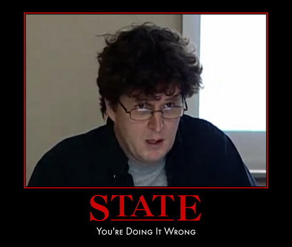

!SLIDE

!SLIDE

!SLIDE

!SLIDE

@@@ clojure
(defn tax-for [price]
  ; bindings, not mutation
  (let [general-sales-tax (calculate-gst price)
        provincial-sales-tax (calculate-pst price)]
    ; single return point means every function's
    ; purpose is to return a value.
    (+ general-sales-tax provincial-sales-tax)))
@@@

!SLIDE

# FEELING GOOD

!SLIDE

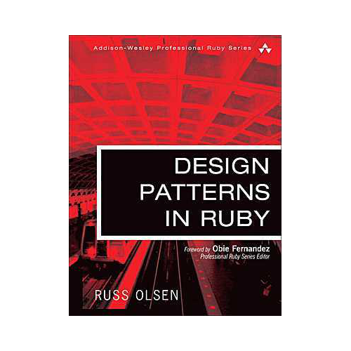

!SLIDE

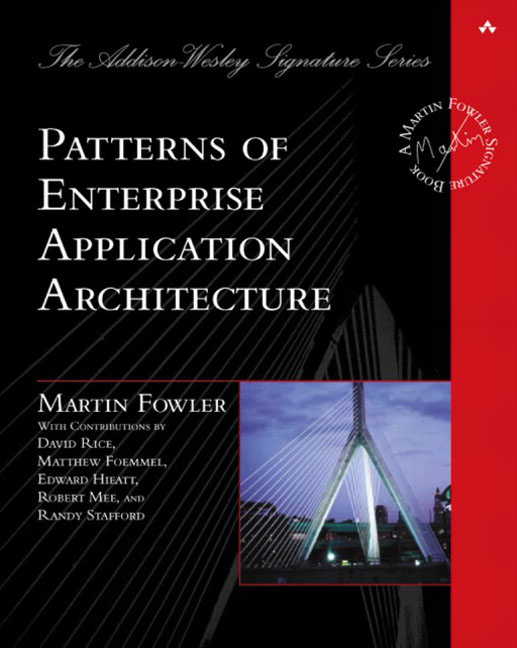

!SLIDE

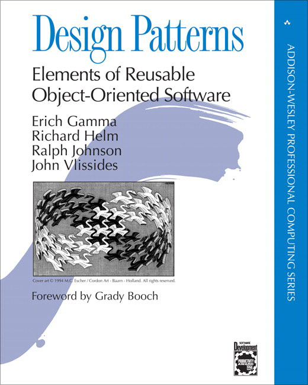

!SLIDE

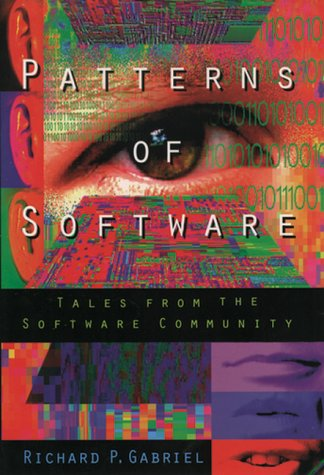

!SLIDE

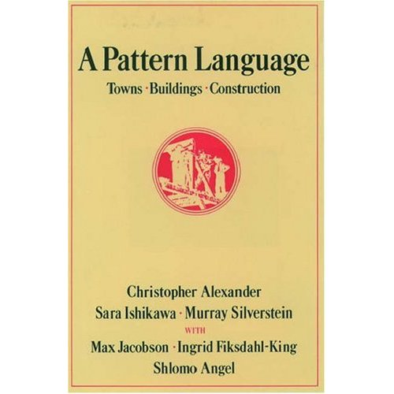

!SLIDE

# Quality Without a Name

!SLIDE

# Je ne c'est quoi

!SLIDE

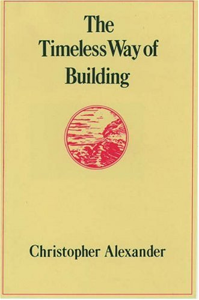

### "What _feeling_ do you have about this building?"

!SLIDE

@@@ ruby
class Logger
  include Mailbox

  mailslot
  def log(message)
    p "Logging on Thread #{Thread.current.object_id} - #{message}"
  end
end
@@@

### What _feeling_ do you have about this code?

!SLIDE

# ( mailbox.rb )

!SLIDE

### What _feeling_ do you have about that code?

!SLIDE

# METAPROGRAMMING

!SLIDE

@@@ ruby
class Sandbox
  define_method :xyz do |*args|
    yield(*args)
  end
end

Sandbox.new.xyz(4,5,6) {|*args| p args}
@@@

    => LocalJumpError: no block given

!SLIDE

@@@ ruby
class Bandsox
  define_method :xyz do |*args, &block|
    block.call(*args)
  end
end

SandBox.new.abc(1,2,3) {|*args| p args}
@@@

    => [1, 2, 3]

!SLIDE

### lambda? def? block? Proc? Method? Oh my!

!SLIDE

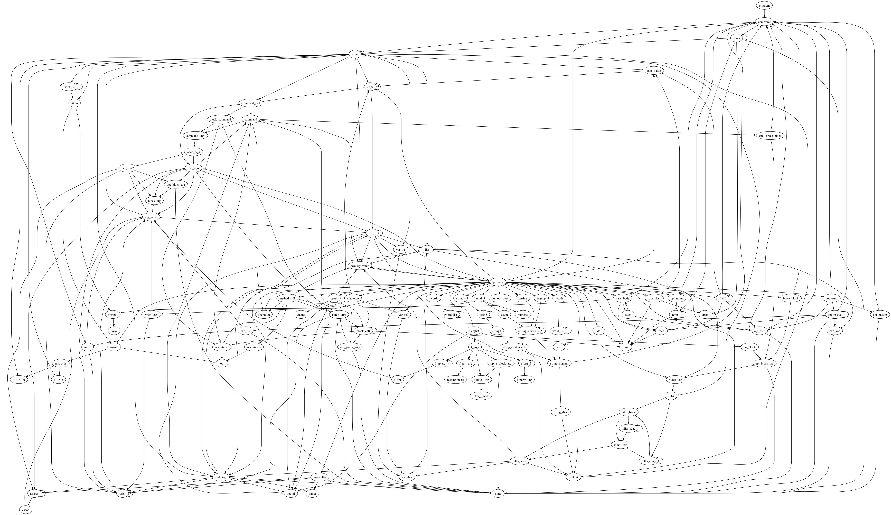

!SLIDE

@@@ clojure
(fn [the-numbers]
  (reduce + 42 the-numbers))
@@@

!SLIDE

@@@ clojure
(def c42-adder 
  (fn [the-numbers]
    (reduce + 42 the-numbers))
@@@

@@@ clojure
(defn c42-adder [the-numbers]
  (reduce + 42 the-numbers))
@@@

!SLIDE

### (homoiconicity)

!SLIDE

@@@ clojure
(def project {:name "Zig" :path "/home/steven/code/zig"})

(.endsWith 
  (str 
    (first 
      (.listFiles 
        (clojure.java.io/file 
          (:path project))))) 
  ".jpg")

(-> project :path 
            clojure.java.io/file 
            .listFiles 
            first 
            str 
            (.endsWith ".jpg"))
@@@

!SLIDE

@@@ clojure
(defmacro ->
  ([x] x)
  ([x form] (if (seq? form)
              (with-meta `(~(first form) ~x ~@(next form)) (meta form))
              (list form x)))
  ([x form & more] `(-> (-> ~x ~form) ~@more)))
@@@

!SLIDE

### (homoiconicity)

!SLIDE

# you can't get there from here.

!SLIDE

### data -> functions -> macros -> compilers

!SLIDE

# COMPILERS

@@@ clojure
(defn emit-fn-method
  [{:keys [gthis name variadic params statements ret env recurs max-fixed-arity]}]
  (emit-wrap env
             (print (str "(function " name "(" (comma-sep params) "){\n"))
             (when gthis
               (println (str "var " gthis " = this;")))
             (when recurs (print "while(true){\n"))
             (emit-block :return statements ret)
             (when recurs (print "break;\n}\n"))
             (print "})")))
@@@

!SLIDE

# MACROS

@@@ clojure
(let [x true
      y true
      z true]
  (match [x y z]
     [_     false true ] 1
     [false true  _    ] 2
     [_     _     false] 3
     [_     _     true ] 4))
@@@

    => 4

!SLIDE

@@@ clojure
(let [x true
      y true
      z true]
  (match [x y z]
     [_     false true ] (mutate-something)
     [false true  _    ] (do-something-expensive)
     [_     _     false] (stop-the-program)
     [_     _     true ] (kill-a-thread)))
@@@

    => ; kills a thread

!SLIDE

# 1761 lines.

!SLIDE

# 1761 LINES!

!SLIDE

### (homoiconicity)

!SLIDE

# navigate disappointment?

!SLIDE

!SLIDE

!SLIDE

# eliminate disappointment!

!SLIDE

@@@
loop
for
comment
dosync
ns
while
case
cond
and
or
import
let
fn
@@@

!NOTES

->
->>
when
when-not
cond
lazy-seq
delay
and
or
defmulti / defmethod
binding
declare
doseq
import
doto
let
fn
loop
for
comment
dosync
ns
while
case

!SLIDE

### (homoiconicity)

!SLIDE

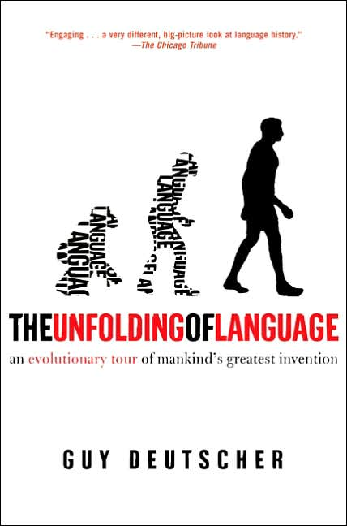

!SLIDE

# FUNCTIONS

!SLIDE

@@@ clojure
(ns amazing-webapp.core
  (:use ring.adapter.jetty)
  (:use ring.middleware.reload)
  (:use ring.middleware.stacktrace))

(defn handler [req]
  {:status  200
   :headers {"Content-Type" "text/html"}
   :body    (str "<html><body><h1>"
                 "Hey guys, we're totally in beta."
                 "</h1></body></html>")})

(defn wrap-teapot-gets [handler]
  (fn [request]
    (if (= :get (:request-method req))
      (handler (assoc request :status 418))
      (handler request))))

(def app
  (-> #'handler
    (wrap-session)
    (wrap-flash)
    (wrap-reload '(amazing-webapp.core))
    (wrap-stacktrace)
    (wrap-teapot-gets)))

(defn -main []
  (run-jetty #'app {:port 8080}))
@@@

!SLIDE

# DATA STRUCTURES

@@@ ruby
xm.html {                   # <html>
    xm.head {               #   <head>
      xm.title("History")   #     <title>History</title>
    }                       #   </head>
    xm.body {               #   <body>
      xm.h1("Header")       #     <h1>Header</h1>
      xm.p("paragraph")     #     
paragraph

    }                       #   </body>                  
  }                         # </html>
@@@

@@@ clojure
(html                       ; <html>
  [:head                    ;   <head>
    [:title "History"]]     ;     <title>History</title> 
                            ;   </head>
  [:body                    ;   <body>
    [:h1 "Header"]          ;     <h1>Header</h1>
    [:p "paragraph"]])      ;     
paragraph

                            ;   </body>
                            ; </html>
@@@

!SLIDE

# MESSAGING CONCURRENCY

!SLIDE

### mailbox? eventmachine?

!SLIDE

# ( demo/core.clj )

!SLIDE

### NOW WHAT?

- labrepl: https://github.com/relevance/labrepl
- joy of clojure: http://joyofclojure.com/the-book/

### ...

### BIBLIOGRAPHY

- http://dreamsongs.net/Files/PatternsOfSoftware.pdf
- http://en.wikipedia.org/wiki/The_Timeless_Way_of_Building
- http://www.unfoldingoflanguage.com/
