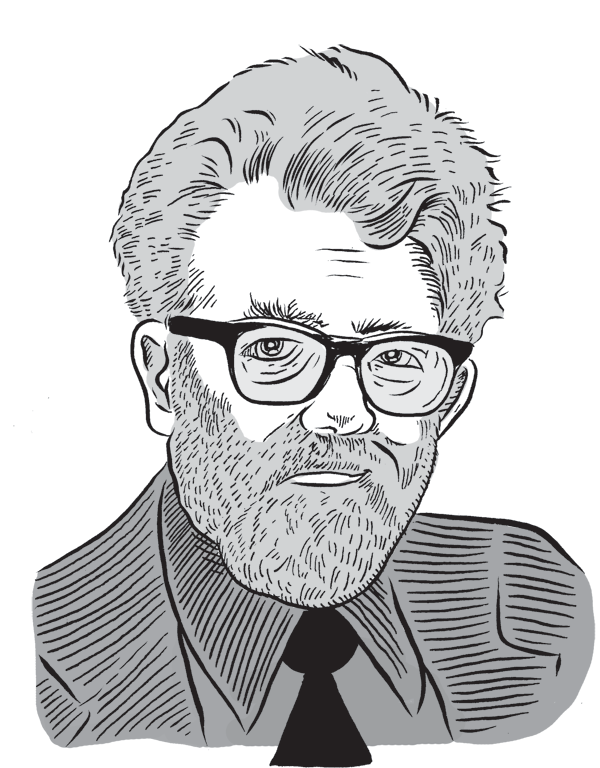
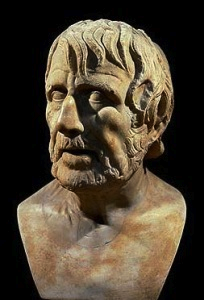

# slides
 
!SLIDE

# clojure is my favourite ruby

## steven@c42.in

!SLIDE

# who am I?

!NOTES

here are some notes

!SLIDE

!SLIDE

!SLIDE

!SLIDE

!SLIDE

!SLIDE

1. t-logger (12 lines of clojure)
2. market data republisher (300 lines of clojure)
3. web app + service (2000 lines of clojure)
4. _trade capture and positions management_ (5000 lines of ruby)

!SLIDE

!SLIDE

!SLIDE

# (clojuremonk.com is coming)

!SLIDE

# TODO: revisit

1. baseline
2. history
3. optional intro
4. curiosity
5. good feelings
6. homoiconicity
7. state of the world

!SLIDE

# BASELINE

!SLIDE

# have you read about clojure?

!SLIDE

# have you tried clojure?

!SLIDE

# have you read some lisp literature?

### (sicp, little schemer, land of lisp, etc.)

!SLIDE

# do you believe this?

@@@ clojure
(= closure object)
@@@

!SLIDE

# (we'll come back to this)

!SLIDE

# INTRO

!SLIDE

@@@ clojure
(stretch image 128)
@@@

!SLIDE

@@@ clojure
(stretch image 128)
@@@

# function call

!SLIDE

@@@ clojure
(when-not (stretched? image)
  (stretch image 128))
@@@

!SLIDE

@@@ clojure
(when-not (stretched? image)
  (stretch image 128))
@@@

# macro call

!SLIDE

# (that's nice, isn't it?)

!SLIDE

@@@ clojure
(defmacro when-not
  "Evaluates test. If logical false, evaluates body in an implicit do."
  {:added "1.0"}
  [test & body]
    (list 'if test nil (cons 'do body)))
@@@

!SLIDE

# "if you want a different for-loop, just write one. you shouldn't have to wait for someone else to do it."

!SLIDE

@@@ clojure
[one two three four]
@@@

!SLIDE

@@@ clojure
[one two three four]
[one, two, three, four]
@@@

# vector

!SLIDE

@@@ clojure
{ :name  "Steven Deobald"
  :has   "Wood"
  :needs "Gold" }
@@@

!SLIDE

@@@ clojure
{ :name  "Steven Deobald"
  :has   "Wood"
  :needs "Gold" }
@@@

# map

!SLIDE

@@@ clojure
(map inc [3 7 14 15 22 41])
@@@

!SLIDE

@@@ clojure
'(one two three four seven)
@@@

!SLIDE

@@@ clojure
'(one two three four seven)
@@@

# seq (list)

!SLIDE

@@@ clojure
['one' 'two' 'three' 'four' 'seven']
@@@

!SLIDE

@@@ clojure
['one' 'two' 'three' 'four' 'seven']
@@@

# garbage!

!SLIDE

    => [one' two' three' four' seven']

!SLIDE

@@@ clojure
["one" "two" "three" "four" "seven"]
@@@

# strings are always double-quotes

!SLIDE

# HISTORY

!SLIDE

# 1958

!SLIDE

!SLIDE

!SLIDE

!SLIDE

# AI

### code written in its own data structures

!SLIDE

# 1966 - 1990

### "AI winter"

!SLIDE

# 1970

!SLIDE

# yay, memory management!

!SLIDE

!SLIDE

# 30 years go by.

!SLIDE

* Stanford LISP
* MACLISP
* InterLisp
* Franz Lisp
* XLISP
* Standard Lisp
* ZetaLisp
* Le Lisp
* Spice Lisp
* NIL
* S-1 Lisp
* Dylan
* EuLisp
* ISLISP
* Scheme
* Common Lisp
* ACL2

!SLIDE

# why another lisp? why now?

!SLIDE

# literature

### sicp, reasoned schemer, lisp in small pieces

!SLIDE

# <3 homoiconicity

### a language written in its own data structures may not have beaten the touring test, but it's still a good idea.

!SLIDE

# why clojure, specifically?

!SLIDE

# "concurrency is the new memory management"

!SLIDE

# do you have multiple cores in the laptop in front of you?

!SLIDE

# time matters

!SLIDE

!SLIDE

# rake db:migrate

!SLIDE

!SLIDE

# ( time.avi )

!SLIDE

# clojure reference types!

!SLIDE

# atom

@@@ clojure
(def me (atom {:name "Steven" :age 30}))

(defn celebrate-birthday [person]
  (assoc person :age (inc (:age person))))

(swap! me celebrate-birthday)
@@@

!SLIDE

# ref

@@@ clojure
(def me (atom {:name "Steven" :age 30}))

(defn celebrate-birthday [person]
  (assoc person :age (inc (:age person))))

(dosync ; start a transaction
  (alter me celebrate-birthday))
@@@

!SLIDE

# agent

@@@ clojure
(def me (atom {:name "Steven" :age 30}))

(defn celebrate-birthday [person]
  (assoc person :age (inc (:age person))))

(send me celebrate-birthday)
@@@

!SLIDE

# java.util.concurrent

@@@ clojure
(defn pipe []
  (let [q (java.util.concurrent.LinkedBlockingQueue.)
        EOQ (Object.)
        NIL (Object.)
        s (fn s [] (lazy-seq (let [x (.take q)]
                               (when-not (= EOQ x)
                                 (cons (when-not (= NIL x) x) (s))))))]
    [(s) (fn ([] (.put q EOQ)) ([x] (.put q (or x NIL))))]))
@@@

!SLIDE

# also, immutability is good for teeth.

!SLIDE

# CURIOSITY IS FUN

!SLIDE

# did `irb` change the way you program? (hands)

!SLIDE

# how about `rails console`?

!SLIDE

# leiningen

@@@
mkdir ~/bin
cd ~/bin
wget http://is.gd/leiningen
mv leiningen lein
chmod +x lein
...
lein new playproject
lein repl
@@@

!SLIDE

# TODO: ( emacs-demo.clj )

- parens aren't evil when they're used correctly (oracle db conn string)

!SLIDE

# FUNCTIONAL PROGRAMMING

!SLIDE

# higher-order functions

!SLIDE

@@@ ruby
["beer", "doughnuts", "coffee", "hockey"].map do |cliche|
  cliche.upcase
end
@@@

!SLIDE

@@@ ruby
["beer", "doughnuts", "coffee", "hockey"].map(&:upcase)
@@@

!SLIDE

@@@ ruby
class Canadian
  def say(word)
    "#{word}, eh?"
  end
end

harper = Canadian.new

["beer", "doughnuts", "coffee", "hockey"].map do |cliche|
  harper.say(cliche)
end
@@@

    => ["beer, eh?", "doughnuts, eh?", "coffee, eh?", "hockey, eh?"]

!SLIDE

@@@ clojure
(defprotocol Sayable
  (say [this s]))
 
(deftype Canadian []
  Sayable
  (say [this s] (str s ", eh?")))

(def harper (Canadian.))

(defn say-as-harper [s]
  (say harper s))

(map say-as-harper ["beer", "doughnuts", "coffee", "hockey"])
@@@

    => ("beer, eh?" "doughnuts, eh?" "coffee, eh?" "hockey, eh?")

!SLIDE

# the spectrum of functional-ness

!SLIDE

@@@ ruby
def tax_for(price)
  general_sales_tax = calculate_gst(price)
  provincial_sales_tax = calculate_pst(price)
  @tax = general_sales_tax + provincial_sales_tax
end
@@@

@@@ clojure
(defn tax-for [price]
  (let [general-sales-tax (calculate-gst price)
        provincial-sales-tax (calculate-pst price)]
    (+ general-sales-tax provincial-sales-tax)))
@@@

### ...and then there's haskell.

!SLIDE

!SLIDE

!SLIDE

!SLIDE

!SLIDE

!SLIDE

@@@ ruby
def tax_for(price)
  # potential mutation
  general_sales_tax = calculate_gst(price)
  # potential mutation
  provincial_sales_tax = calculate_pst(price)
  # definite mutation
  @tax = general_sales_tax + provincial_sales_tax
end
@@@

!SLIDE

!SLIDE

!SLIDE

!SLIDE

!SLIDE

!SLIDE

@@@ clojure
(defn tax-for [price]
  ; bindings, not mutation
  (let [general-sales-tax (calculate-gst price)
        provincial-sales-tax (calculate-pst price)]
    ; single return point means every function's
    ; purpose is to return a value.
    (+ general-sales-tax provincial-sales-tax)))
@@@

!SLIDE

# FEELING GOOD

!SLIDE

!SLIDE

!SLIDE

!SLIDE

!SLIDE

!SLIDE

# Quality Without a Name

!SLIDE

# Je ne c'est quoi

!SLIDE

### "What _feeling_ do you have about this building?"

!SLIDE

@@@ ruby
class Logger
  include Mailbox

  mailslot
  def log(message)
    p "Logging on Thread #{Thread.current.object_id} - #{message}"
  end
end
@@@

### What _feeling_ do you have about this code?

!SLIDE

# ( mailbox.rb )

!SLIDE

### What _feeling_ do you have about that code?

!SLIDE

# META-PROGRAMMING

!SLIDE

@@@ ruby
class Sandbox
  define_method :xyz do |*args|
    yield(*args)
  end
end

Sandbox.new.xyz(4,5,6) {|*args| p args}
@@@

    => LocalJumpError: no block given

!SLIDE

@@@ ruby
class Bandsox
  define_method :xyz do |*args, &block|
    block.call(*args)
  end
end

SandBox.new.abc(1,2,3) {|*args| p args}
@@@

    => [1, 2, 3]

!SLIDE

### lambda? block? Proc? Method? Oh my!

!SLIDE

!SLIDE

@@@ clojure
(fn [the-numbers]
  (reduce + 42 the-numbers))
@@@

!SLIDE

@@@ clojure
(def c42-adder 
  (fn [the-numbers]
    (reduce + 42 the-numbers))
@@@

@@@ clojure
(defn c42-adder [the-numbers]
  (reduce + 42 the-numbers))
@@@

!SLIDE

### (homoiconicity)

!SLIDE

@@@ clojure
(def project {:name "Zig" :path "/home/steven/code/zig"})

(.endsWith (str (first (.listFiles (io/file (:path project))))) ".jpg")

(-> project :path clojure.java.io/file .listFiles first str (.endsWith ".jpg"))
@@@

!SLIDE

@@@ clojure
(defmacro ->
  ([x] x)
  ([x form] (if (seq? form)
              (with-meta `(~(first form) ~x ~@(next form)) (meta form))
              (list form x)))
  ([x form & more] `(-> (-> ~x ~form) ~@more)))
@@@

!SLIDE

# BIBLIOGRAPHY

!SLIDE

- http://dreamsongs.net/Files/PatternsOfSoftware.pdf

!SLIDE

- curiosity is joy | repl is joy
- emacs is a living repl | overtone

- learn clojure in 2 minutes?
- kernel

- q.w.a.n. / je ne c'est quoi

- navigating disappointment (eliminating disappointment)
- the unfolding of language
- church numerals?

- EventMachine vs. Agents demo

- Date/Time vs. joda (clj-time)
